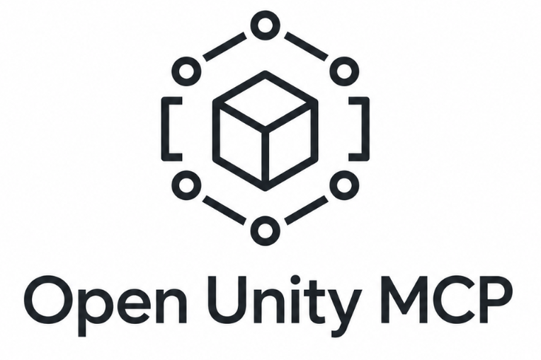

<p align="center">
  
</p>

<h1 align="center">Open Unity MCP</h1>

<p align="center">
  <strong>A local Model Context Protocol server for the Unity 6+ Editor.</strong>
</p>

<p align="center">
  <a href="https://unity.com/releases/editor/whats-new/6000.0.0"></a>
  
  
  <a href="../../LICENSE.md"></a>
</p>

<p align="center">
  <a href="#quick-start">Quick Start</a> |
  <a href="Documentation~/client-setup.md">Client Setup</a> |
  <a href="Documentation~/tools.md">Tool Reference</a> |
  <a href="Documentation~/architecture.md">Architecture</a>
</p>

Open Unity MCP runs inside the Unity Editor and exposes a local Streamable HTTP MCP endpoint. Agents can inspect your project, create and modify scene objects, work with prefabs, capture Scene View images, and use editor automation tools without a separate Unity relay application.

## At A Glance

| Area | Details |
| --- | --- |
| Endpoint | `http://127.0.0.1:8080/mcp` |
| Server name | `open-unity-mcp` |
| Unity UI | **Preferences > Open Unity MCP** |
| Quick actions | **Tools > Open Unity MCP** and the Scene View toolbar badge |
| Package path | `Packages/com.strangeape.open-unity-mcp` |

## Why Use It

- **Install as a package:** add it through Unity Package Manager with a Git URL.
- **Stay local:** the server binds to `127.0.0.1` and rejects non-local browser origins.
- **Use real Unity context:** tools return Unity object IDs, hierarchy state, transforms, prefab data, console logs, and editor status.
- **Build scenes faster:** create batches of primitives, fix transforms, save prefabs, frame objects, and capture Scene View PNGs for vision-capable agents.
- **Connect common clients:** setup helpers configure Claude Code, Codex, and Claude Desktop.

## Install

Open your Unity 6+ project, then install the package:

1. Open **Window > Package Manager**.
2. Click **+**.
3. Choose **Add package from git URL...**.
4. Paste:

```text
https://github.com/parodyband/unity-mcp.git?path=/Packages/com.strangeape.open-unity-mcp
```

5. Click **Add**.

You can also add the dependency directly to `Packages/manifest.json`:

```json
{
  "dependencies": {
    "com.strangeape.open-unity-mcp": "https://github.com/parodyband/unity-mcp.git?path=/Packages/com.strangeape.open-unity-mcp"
  }
}
```

## Quick Start

1. Open **Preferences > Open Unity MCP**.
2. Click **Start**.
3. Connect your MCP client to:

```text
http://127.0.0.1:8080/mcp
```

The Scene View toolbar badge shows server status and includes quick start/stop controls. Use **Tools > Open Unity MCP > Preferences** to jump back to settings.

## Client Setup

Use **Preferences > Open Unity MCP > Client Setup** to configure supported clients:

| Client | Config updated | Transport |
| --- | --- | --- |
| Claude Code | `.mcp.json` in the Unity project root | stdio sidecar (survives reloads) |
| Codex | `~/.codex/config.toml` | stdio sidecar (survives reloads) |
| Claude Desktop | `claude_desktop_config.json` | stdio sidecar (survives reloads) |

### Recommended: the reload-surviving sidecar

Setup helpers configure a small Node stdio sidecar (`Server~/open-unity-mcp-sidecar.js`, Node 18+, zero dependencies) as the endpoint your client connects to. The sidecar forwards to the in-editor HTTP server and rides out domain reloads, so the MCP session survives recompiles instead of dropping with a connection error. This is the recommended transport for all clients.

Clients that speak Streamable HTTP directly can still connect to `http://127.0.0.1:8080/mcp`, but that connection drops on every recompile.

```toml
[mcp_servers.open-unity-mcp]
url = "http://127.0.0.1:8080/mcp"
```

Read the full guide: [Documentation~/client-setup.md](Documentation~/client-setup.md) (and the sidecar's own [Server~/README.md](Server~/README.md)).

## What Agents Can Do

| Category | Examples |
| --- | --- |
| Project context | Project info, package list, build settings, compilation status |
| Assets | Find, import, refresh, read/write text, create folders, copy, move, delete |
| Scenes | List scenes, read hierarchy, open, save, save all, close |
| GameObjects | Create objects, create batches, select objects, set transforms |
| Components | List components, add components, inspect and edit serialized properties |
| Prefabs | Inspect prefab info, instantiate prefabs, save scene objects as prefab assets |
| Scene View | Set camera, frame objects, capture PNG screenshots as MCP image content |
| Editor automation | Read and clear console logs, execute menu items, enter play mode |
| Validation and builds | Validate project state, request script compilation, run restricted builds |

Full reference: [Documentation~/tools.md](Documentation~/tools.md).

## Resources And Prompts

Open Unity MCP also exposes MCP resources and prompts so clients can discover project context without mutating editor state.

- `unity://project/info`
- `unity://editor/selection`
- `unity://scene/open-scenes`
- `unity://docs/tools`
- `unity_editor_task`
- `unity_code_review`

## Safety Boundaries

Open Unity MCP is built for local editor automation, but many tools can mutate your project. Keep client-side approvals enabled for write-capable tools.

- Server binds to `127.0.0.1` only.
- Non-local browser origins are rejected.
- Asset writes are scoped to `Assets` and `Packages`.
- Protected roots such as `Assets` and `Packages` cannot be deleted through lifecycle tools.
- Scene lifecycle tools protect dirty scenes unless the caller explicitly saves or discards changes.
- Player builds are restricted to the project `Builds/` folder.

## Documentation

- [Client setup](Documentation~/client-setup.md)
- [Tool reference](Documentation~/tools.md)
- [Architecture notes](Documentation~/architecture.md)
- [Changelog](CHANGELOG.md)
- [License](../../LICENSE.md)
